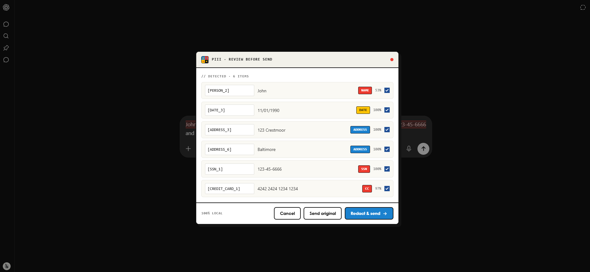
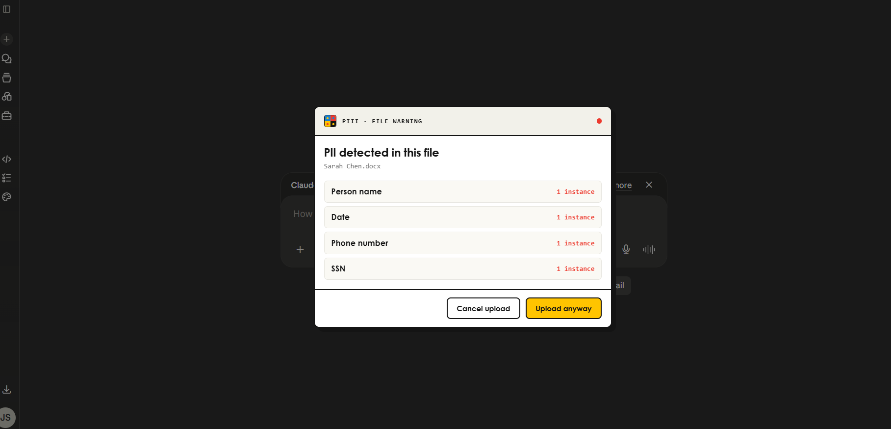
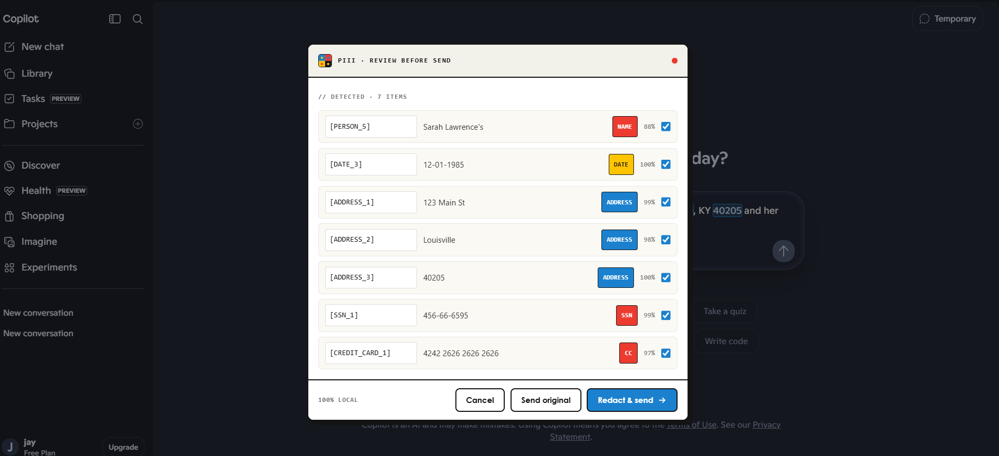
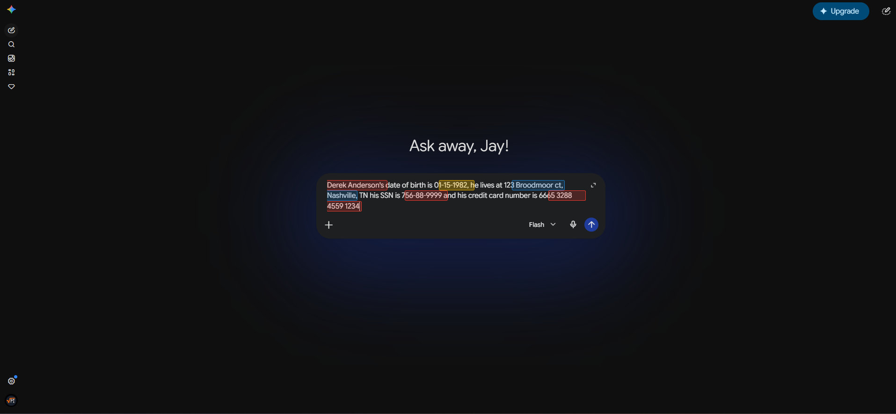
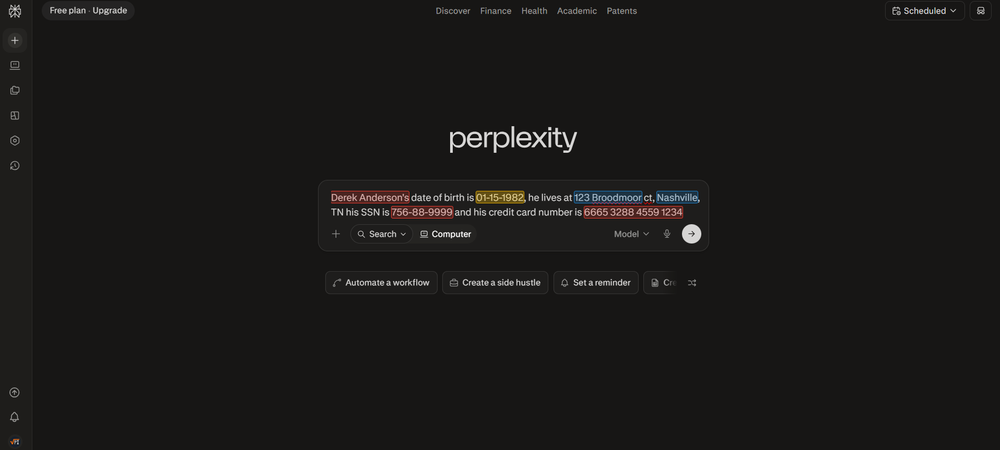
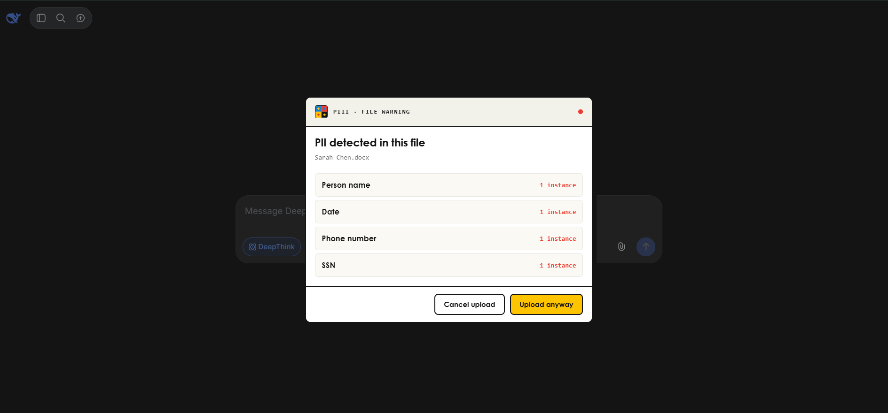

# PiiI

**Detect and mask personal data before it ever reaches an AI chatbot.**

PiiI is an open-source Chrome (Manifest V3) extension that intercepts your prompt as you send it to an AI chat platform, finds the personal data inside it, and offers to swap each value for an alias before the message leaves your browser.
Detection and machine-learning inference run entirely on your machine.
No prompt text, and no detected data, is ever sent to a server.



[](LICENSE)

## Why

Pasting a customer email, a contract, or a stack trace into ChatGPT is the fastest way to leak data you did not mean to share.
PiiI sits between you and the send button: it highlights the sensitive spans, lets you accept the suggested aliases (`[NAME_1]`, `[EMAIL_1]`, ...), and sends the redacted version instead.
You keep a local map of which alias stands for which real value, so the replies still make sense to you.

## How it works

1. A content script runs only on the supported chat domains and watches for a submit (Enter or the send button).
2. Before the message goes out, the text runs through two detectors:
   - **Regex** for structured data: email, phone, SSN, credit card, API key, account/ID number, URL, date.
   - **A local ONNX NER model** ([`onnx-community/multilang-pii-ner-ONNX`](https://huggingface.co/onnx-community/multilang-pii-ner-ONNX)) for unstructured data: names and addresses.
3. The model runs in an offscreen document via `onnxruntime-web` (WASM), because service workers cannot load it.
4. Detected spans are shown as overlays; a popup proposes an alias for each one.
5. On accept, the real values are substituted with aliases in the input field, and only then is the message sent.

The ONNX runtime ships inside the extension.
The model weights are downloaded once from the Hugging Face CDN on first run and then cached by the browser; after that, everything is offline and local.

## Privacy model

- **Local-only inference.** Prompt text never leaves your browser. There is no backend, no API, and no telemetry.
- **One-time model download.** The NER weights are fetched from the Hugging Face CDN the first time you use it, then cached. Nothing about your prompts is sent in that request.
- **Local storage only.** The alias map, audit log, and whitelist live in `chrome.storage.local` on your machine.

## Supported platforms

| Platform   | Domain                       | Status    |
|------------|------------------------------|-----------|
| ChatGPT    | `chatgpt.com`, `chat.openai.com` | Supported |
| Claude     | `claude.ai`                  | Supported |
| Gemini     | `gemini.google.com`          | Supported |
| Copilot    | `copilot.microsoft.com`      | Supported |
| Perplexity | `www.perplexity.ai`          | Supported |
| DeepSeek   | `chat.deepseek.com`          | Supported |

## Screenshots

| | |
|---|---|
|  |  |
| **ChatGPT** - redaction popup | **Claude** - `.docx` file scan |
|  |  |
| **Copilot** - pasted prompt | **Gemini** - detection overlays |
|  |  |
| **Perplexity** - detection overlay | **DeepSeek** - `.docx` file scan |

## What it detects

| Source | Categories |
|--------|------------|
| Regex  | email, phone, SSN, credit card, API key, account/ID number, URL, date |
| NER model | name (given name, surname, title), address (street, building number, city, ZIP), plus overlapping coverage of email, phone, SSN, credit card, ID/passport/licence number, and date |

The model also recognises age, gender, and time, but PiiI intentionally leaves those unmasked.

## File scanning

PiiI scans files you attach for the same categories before they are sent.
Supported types: `.txt`, `.csv`, `.md`, `.log`, `.json`, `.docx`, `.pdf`.
Files are capped at 50,000 characters and the scan is fail-closed: if a file cannot be parsed, it is blocked rather than passed through unchecked.

## Install (from source)

PiiI is not yet on the Chrome Web Store, so build it and load it unpacked.

Requirements: Node 18+ and Chrome 120+.

```bash
git clone https://github.com/JaySmith502/piii.git
cd piii
npm install
npm run build
```

Then:

1. Open `chrome://extensions`.
2. Enable **Developer mode** (top right).
3. Click **Load unpacked** and select the `dist/` folder.
4. On first use, give the NER model a few seconds to download.

For watch mode during development, run `npm run dev` and reload the extension after each build.

A detailed walkthrough, including per-feature verification and a Chrome Web Store submission checklist, is in [`deploy-guide.html`](deploy-guide.html).

## Usage

1. Open one of the supported chat platforms.
2. Type or paste a prompt that contains personal data.
3. PiiI highlights the detected spans and shows a redaction popup.
4. Review the proposed aliases, then accept to send the redacted message, edit it, or send the original.

The toolbar popup gives you:

- **Alias map** for the current conversation, so you can read replies in context.
- **Audit log** of what was detected and which action you took, exportable to CSV.
- **Whitelist** of terms you never want flagged again.

## Known limitations

- **Grok is not supported.** Its composer is unreachable from the content script's isolated world, so PiiI cannot intercept it. The code is shelved in `src/content/adapters/grok.ts`.
- **First-run latency.** The model download (one time) means the very first prompt on a fresh install waits a few seconds before detection is ready.
- **Single-language UI.** Detection is multilingual via the model, but the extension UI is English only.

## Project layout

```
src/
  background/   service worker, NER bridge, storage, messaging
  offscreen/    ONNX NER pipeline (runs the model)
  content/      content script, platform adapters, detection, substitution
    adapters/   one file per platform (selectors + send logic)
    detection/  regex detectors + merge
    fileScanner/ attachment extraction and scanning
  popup/        toolbar UI (alias map, audit log, whitelist)
```

## License

[MIT](LICENSE)
